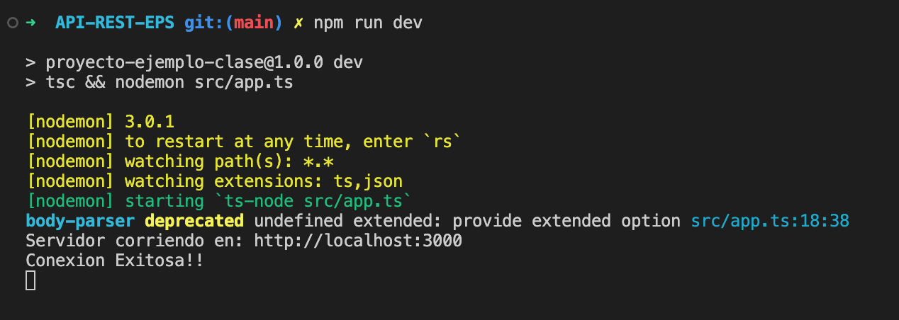

# API REST EPS - CENTRO MEDICO
Tecnología utilizada
- Node.js
- Express.js
- MySQL
- Sequelize
- Typescript
## DESARROLLADA POR 
- Harold Eduardo Rojas Clavijo, Diciembre 2023

## REQUISITOS
   - Tener instalado Node.js
   - Tener instalado MySQL
   - Crear una base de datos en MySQL con el nombre "EPS"
    
### Nota: 

No se requiere crear tablas, pues Sequelize se encarga de crear las tablas a partir del siguiente modelo relacional
- **Doctores** = (**id_prof**, nombre, apellido, especialidad, correo)
- **Pacientes** = (**num_cedula**, nombre, apellido, fecha_nac, telefono)
- **Cita** = (**fecha_hora**, ***id_prof***, ***num_cedula***)

## PASOS PARA UTILIZAR LA API

Guia basica para ejecutar y comprobar el funcionamiento de la API REST

1.  Clonar el repositorio desde la siguiente ubicacion en GITHUB 

```bash
    https://github.com/harold-rojas10/API-REST-EPS.git

```
2. Despues de colonar y abrir el pryecto en VS-Code, se deben instalar los paquetes requeridos con el siguiente comando en la terminal del proyecto 

```bash
    npm install || sudo npm install
```
3. Terminada la instalación de los paquetes, se procede a ejecutar la API con el siguiente comando

```bash
    npm run dev
```

4. Se comprueba que esta corriendo la API, si en la terminal sale el siguiente mensaje

    

5. Ya corriendo la API, con POSTMAN se prueba cada una de las peticiones establecidas para la API

## PETICIONES SOPORTADAS POR LA API

1. 
